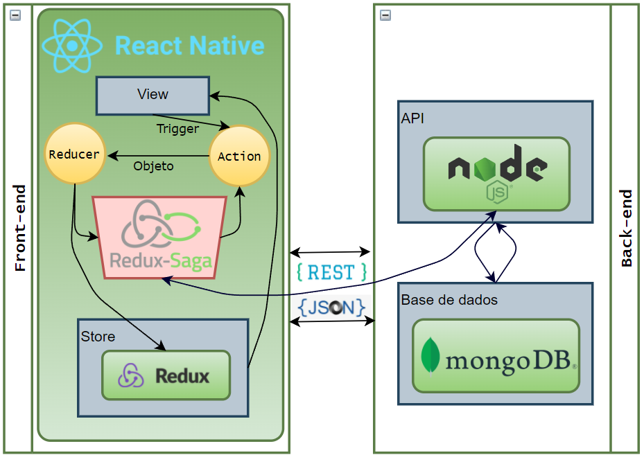
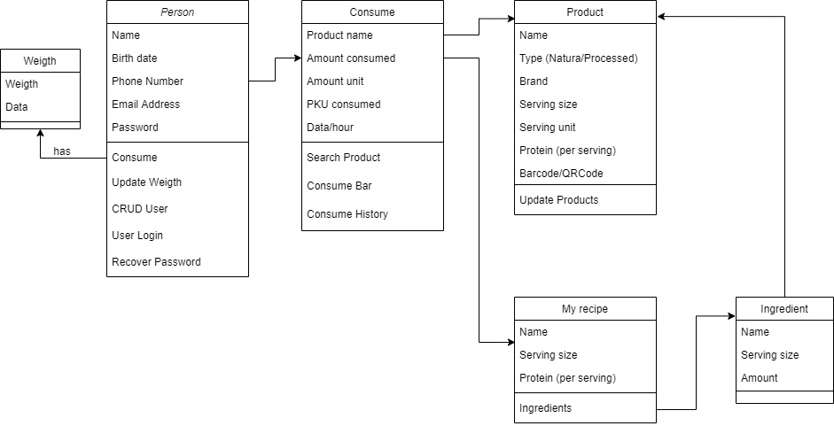
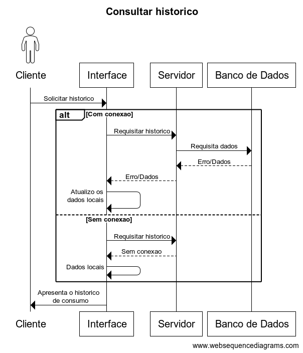
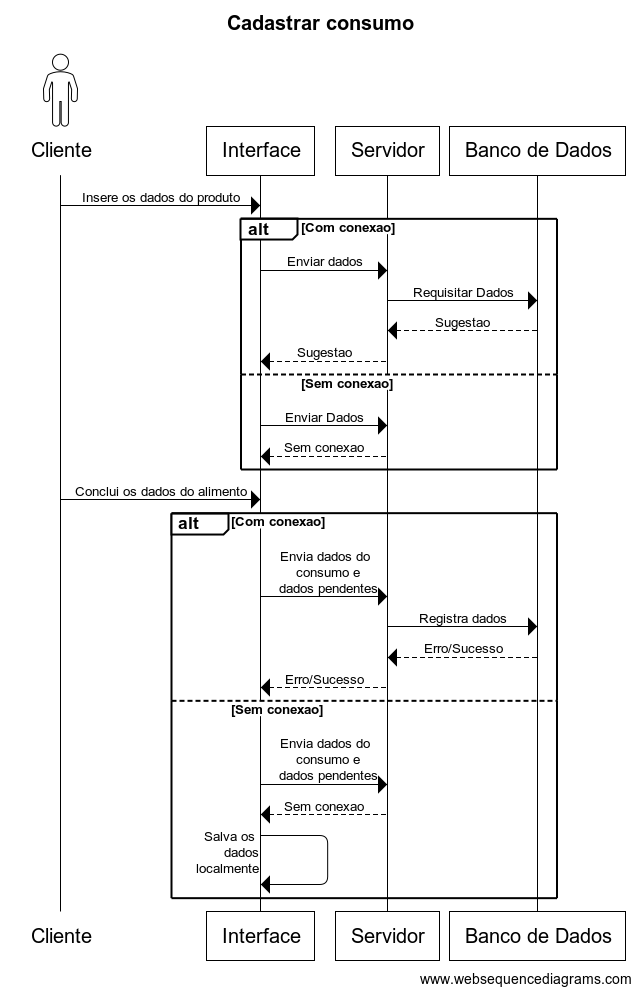
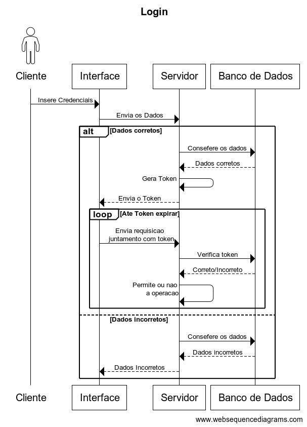

# Sobre o aplicativo
O PKU Monitor é um aplicativo móvel para o acompanhamento dietoterápico de portadores de fenilcetonúria, doença que, a partir do diagnóstico no recém-nascido (por meio do Teste do Pezinho), requer acompanhamento constante, a fim de evitar prejuízos ao desenvolvimento. 
A fenilcetonúria (PKU) é uma doença genética que não tem cura. A única forma de controlar e/ou retardar seus efeitos é controlando a ingestão de PHE, aminoácido presente na proteína dos alimentos. Atualmente, há disponíveis poucos aplicativos mobiles para auxílio ao paciente com PKU, i.e. My diet for PKU (sendo mais focado para balanço nutricional de algumas vitaminas e minerais na dieta do paciente), Dietassistant for PKU, PKU manager. Todos possuem apenas versões em inglês, sem leitor de código de barras, necessitando que o usuário insira manualmente a quantidade de proteínas para que o software faça os cálculos.
O aplicativo proposto permite, a partir dos registros quanti/qualitativo dos alimentos consumidos, mensurar a quantidade de fenilalanina ingerida. Desta forma, o usuário consegue evitar danos ocasionados pela ingesta em excesso, assim como deficiência protéica na alimentação de muitos fenilcetonúricos. Por ser um sistema automatizado que se baseia na tabela nutricional, há evidente redução das falhas quando comparado ao método manual usualmente aplicado pelos pacientes e cuidadores. A aplicação mobile consiste no cadastro de usuário, alteração de dados do usuário, inserção de um produto para que todos os outros usuários possam utilizá-lo, se tornando assim uma aplicação colaborativa (com armazenamento em nuvem) e o controle diário de proteína do usuário.
Este projeto teve início em 2017, sendo objeto de um TCC (Górski et al., 2017) e continuado em 2019, em um trabalho de estágio supervisionado (Urtado & Piekarski, 2019). Frente às necessidades de atualizações tecnológicas que permitam disponibilizar uma versão funcional, foi proposto um projeto de extensão, que teve início em dezembro de 2020 (Piekarski et al., 2020). A intenção era retomar o projeto e acrescentar funcionalidades. No entanto, não foi possível executar o projeto disponibilizado. Então, uma nova versão está sendo desenvolvida, considerando os requisitos já existentes.
A equipe, atualmente composta por três acadêmicos do Bacharelado em Ciência da Computação, sob a mentoria de dois egressos, conta também com profissionais da área de saúde, que fornecem as informações técnicas necessárias e convalidam o modelo do aplicativo.

# Sobre o projeto
A equipe de desenvolvimento tem reuniões semanais, a fim de discutir o andamento do projeto. São discutidas as tecnologias adotadas, verificadas as tarefas executadas, definidas as próximas etapas.
Eventualmente, reuniões técnicas são realizadas, a fim de suprir demandas tecnológicas. Da mesma forma, são feitas reuniões com os membros da equipe da área de saúde para convalidar as etapas realizadas ou definir aspectos que requerem conhecimentos especializados.
Para o acompanhamento do projeto, estão sendo utilizadas as seguintes ferramentas: Trello, GITHub e ClickUp. O ambiente de desenvolvimento que está sendo utilizado pelos desenvolvedores é o Visual Sudio Code.

# Implementação
Para a implementação do protótipo, foram consideradas algumas das tecnologias mais comumente utilizadas (estado do mercado). Considerando a experiência da equipe de desenvolvedores e dos mentores, bem como o material de apoio disponível na internet, optou-se por utilizar a plataforma React Native.  
O protótipo do front-end foi desenvolvido utilizando React Native, a biblioteca Redux e o middleware Redux-Saga. A Figura 4 contém um esquema da arquitetura do protótipo, com as tecnologias utilizadas. Na Figura 5, é possível ver algumas telas do protótipo.
Para o back-end, devem ser avaliadas a plataforma Node e como base de dados, o serviço MongoDB. 

# Identidade visual

# Próximas etapas
Conforme o projeto do aplicativo, além do redesenho das telas, deve ser implementado o back-end. Uma demanda importante é a forma de sincronização dos dados, pois o aplicativo deve ser funcional mesmo em situações onde não há disponibilidade de internet, garantindo a integridade dos dados para os usuários. 

# Arquitetura

# Diagramas
### Diagrama de classe
  
### Diagrama Logico do banco de dados
### Diagrama de Sequencia

  
  
  

# Tecnologias utilizadas
## Front-End
### Saga
  <blockquote><a href="https://redux-saga.js.org/" target="_blank">Saga</a> eh...</blockquote>
  
### Redux
### Axios
### Navigation 
### Expo
### Yarn
### Style
### Node modules

## Back-End
### Spring
### Rest
### Maven
### Toncat
### Swagger

## Outras
### Trello
### Flux
### Git
### Docker
